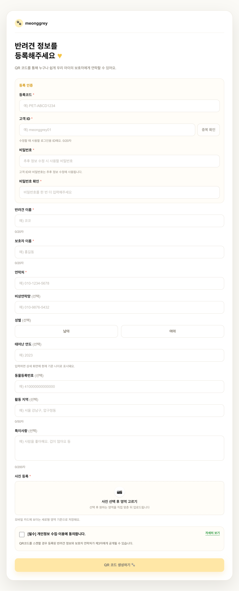
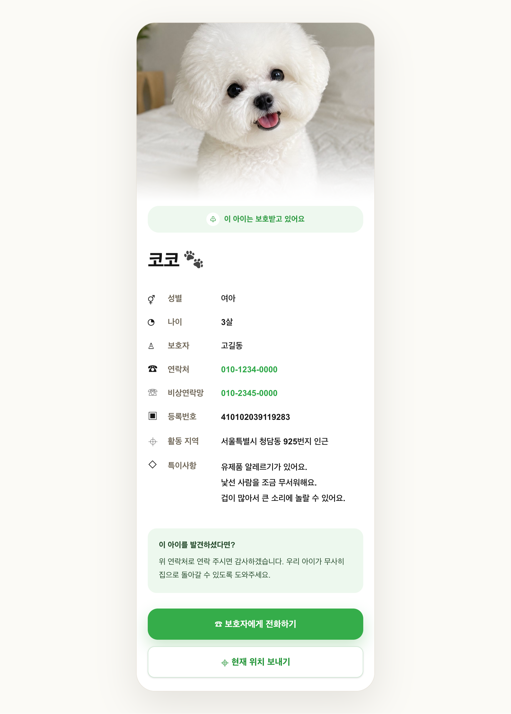
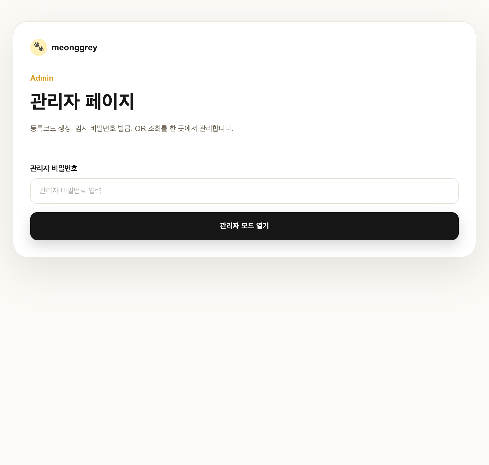

# Pet ID MVP 🐾

반려견 인식표 QR 코드를 통해 보호자 정보와 반려견 정보를 확인할 수 있는 웹 서비스입니다.

발견자는 QR을 스캔해 반려견 상세 페이지에서 보호자에게 바로 전화하거나 현재 위치를 문자로 공유할 수 있습니다.  
관리자는 등록코드 생성, 임시 비밀번호 발급, QR 이미지 조회 및 다운로드를 관리할 수 있습니다.

---

## 🔗 Live Demo

- Demo: https://meonggrey.co.kr
- GitHub: https://github.com/ksw110/pet-id-mvp

---

## 📸 Screenshots

### 반려견 등록 화면



### 공개 상세 페이지



### 관리자 페이지



---

## ✨ 주요 기능

### 사용자 기능

- 반려견 정보 등록
- 고객 ID 중복 확인
- 등록코드 검증
- 반려견 사진 업로드 및 크롭
- 공개 상세 페이지 자동 생성
- 보호자 전화 연결
- 현재 위치 문자 공유
- 등록 정보 수정
- 비밀번호 변경

### 관리자 기능

- 관리자 비밀번호 인증
- 등록코드 생성
- 임시 비밀번호 발급
- 보호자 연락처 기반 QR 조회
- QR 이미지 다운로드

---

## 🛠 Tech Stack

- Next.js 16
- React 19
- TypeScript
- Tailwind CSS 4
- Supabase
- Vercel
- QRCode
- Kakao Local API

---

## 📂 주요 페이지

| 경로 | 설명 |
|---|---|
| `/` | 고객 ID 기반 공개 URL 조회 |
| `/register` | 반려견 정보 등록 |
| `/edit` | 반려견 정보 수정 |
| `/pet/[id]` | 공개 반려견 상세 페이지 |
| `/admin` | 관리자 페이지 |
| `/privacy` | 개인정보 처리방침 |

---

## 💡 주요 구현 포인트

### QR 기반 공개 상세 페이지

등록된 반려견마다 고유한 공개 URL을 생성하고 QR 이미지로 저장합니다.  
발견자는 QR을 스캔해 반려견 정보와 보호자 연락처를 확인할 수 있습니다.

### 사진 업로드 및 크롭

업로드한 반려견 사진을 브라우저에서 미리보기 및 크롭 처리한 뒤 저장하도록 구현했습니다.

### 관리자 기능 분리

등록코드 생성, 임시 비밀번호 발급, QR 조회 기능은 관리자 인증 이후 사용할 수 있도록 구성했습니다.

### 비밀번호 보안 처리

비밀번호 원문을 직접 저장하지 않고 해시 처리 후 저장하도록 구성했습니다.

### 위치 공유 기능

브라우저 Geolocation API와 Kakao Local API를 이용해 현재 위치를 주소로 변환하고 보호자에게 문자로 공유할 수 있도록 구현했습니다.

---

## 📁 프로젝트 구조

```txt
src/
  app/
    api/
      pets/
      registration-codes/
      location/
    admin/
    edit/
    pet/[id]/
    register/
    privacy/
  components/
  lib/

docs/
```

---

## 🔐 Environment Variables

```env
NEXT_PUBLIC_SUPABASE_URL=
NEXT_PUBLIC_SUPABASE_KEY=
SUPABASE_SERVICE_ROLE_KEY=
NEXT_PUBLIC_BASE_URL=
KAKAO_REST_API_KEY=
QR_ADMIN_PASSWORD=
```

---

## 📚 학습 문서

- [파일별 읽는 순서 가이드](./docs/FILE_READING_GUIDE.md)
- [React / Next 핵심 개념 정리](./docs/REACT_NEXT_NOTES.md)
- [이 프로젝트로 배우는 React 입문](./docs/PROJECT_LEARNING_PATH.md)
- [CSS / Tailwind 클래스 해설](./docs/CSS_TAILWIND_NOTES.md)

---

## 🚀 Run Locally

```bash
npm install
npm run dev
```

```txt
http://localhost:3000
```

---

## 📖 What I Learned

- Next.js App Router 기반 프로젝트 구조
- Server Component / Client Component 차이 이해
- API Route (`route.ts`) 구현 방식
- Supabase DB 및 Storage 연동
- FormData 기반 파일 업로드 처리
- Canvas 기반 이미지 크롭 처리
- 환경변수를 이용한 민감 정보 분리
- Tailwind CSS 기반 반응형 UI 구성